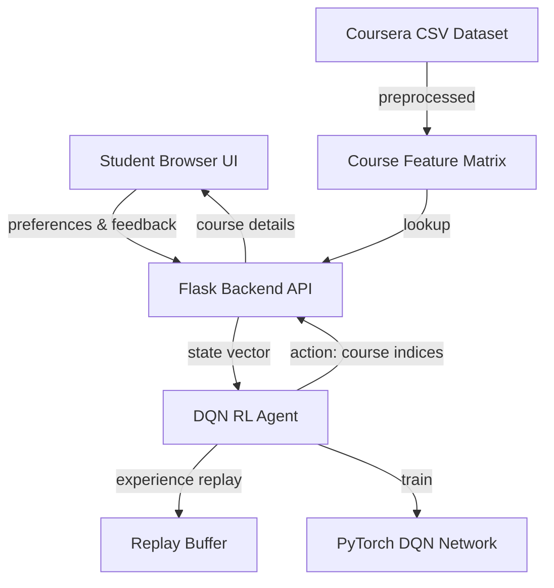

# Course Recommendation System Using Reinforcement Learning

A web platform that recommends Coursera courses to students based on their preferences (skills, difficulty, interests) using a Deep Q-Network (DQN) RL agent.

## How RL Applies Here

Traditional recommendation systems use collaborative/content-based filtering. RL adds an **interactive, adaptive** dimension:

```
┌─────────────┐     Action: Recommend       ┌───────────────┐
│   RL Agent   │ ──── course(s) ──────────►  │   Student      │
│   (DQN)      │                             │   (Environment)│
│              │ ◄─── reward signal ───────  │                │
└─────────────┘     (click/skip/rate)        └───────────────┘
```

| RL Concept | Mapping |
|---|---|
| **State** | Student profile: selected skills, preferred difficulty, preferred duration, interaction history (liked/skipped courses) |
| **Action** | Recommend a course (or top-K courses) from the catalog |
| **Reward** | +1 if student "likes"/enrolls, -0.5 if student "skips", +2 if highly rated course match, -1 for repeated recommendation |
| **Episode** | One student session (student provides preferences → receives recommendations → gives feedback → repeat) |
| **Policy** | The learned strategy for selecting which course to show next |

## Architecture Overview



## Dataset Analysis

The [coursera_course_dataset_v3.csv](file:///e:/COLLEGE/NIRMA/SEM%206/RL/innovative/archive/coursera_course_dataset_v3.csv) has **~3835 courses** with:

| Column | Usage |
|---|---|
| `Title` | Display to user |
| `Organization` | Filter/display |
| `Skills` | **Primary feature** — encoded as multi-hot vector for matching |
| `Ratings` | Reward signal modifier |
| `Difficulty` | State feature (Beginner/Intermediate/Advanced) |
| `Type` | Filter (Course/Specialization/Professional Certificate) |
| `Duration` | State feature |
| `course_students_enrolled` | Popularity score |
| `course_description` | TF-IDF features for content similarity |

## Proposed Changes

### 1. Data Preprocessing Module

#### [NEW] [preprocess.py](file:///e:/COLLEGE/NIRMA/SEM%206/RL/innovative/preprocess.py)

- Load and clean CSV (handle missing values, parse enrolled counts like "700,909")
- Extract unique skills → build skill vocabulary (~500+ unique skills)
- Create multi-hot skill vectors for each course
- Encode `Difficulty` (0=Beginner, 1=Intermediate, 2=Advanced)
- Encode `Duration` (0=1-4 Weeks, 1=1-3 Months, 2=3-6 Months)
- Encode `Type` (0=Course, 1=Specialization, 2=Professional Certificate)
- Normalize ratings and enrollment counts
- Save processed data as pickle for fast loading

---

### 2. RL Environment

#### [NEW] [rl_environment.py](file:///e:/COLLEGE/NIRMA/SEM%206/RL/innovative/rl_environment.py)

- **`CourseRecommendationEnv`** class (Gym-like interface)
- **State space**: Concatenation of:
  - Student skill preferences (multi-hot, top-50 skills)
  - Preferred difficulty (one-hot, 3)
  - Preferred duration (one-hot, 3)
  - Last N recommended course features (flattened)
  - Interaction history embedding (liked/skipped ratio)
- **Action space**: Discrete — index into course catalog (~3835 actions)
- **Reward function**:
  - Skill overlap between student preferences and course: `+overlap_score`
  - Difficulty match: `+0.5` if matches preference
  - High rating course: `+rating/5.0`
  - Already recommended: `-1.0` penalty
  - Student "skip": `-0.5`
  - Student "like": `+1.0`

---

### 3. DQN Agent

#### [NEW] [dqn_agent.py](file:///e:/COLLEGE/NIRMA/SEM%206/RL/innovative/dqn_agent.py)

- **Q-Network**: 3-layer MLP (state_dim → 256 → 128 → num_courses)
- **Target Network**: Soft-updated copy for stable training
- **Experience Replay Buffer**: Stores (state, action, reward, next_state, done)
- **ε-greedy exploration**: Starts at 1.0, decays to 0.1
- **Training loop**: Pre-train with simulated interactions, fine-tune with real user feedback
- Framework: **PyTorch**

---

### 4. Flask Backend API

#### [NEW] [app.py](file:///e:/COLLEGE/NIRMA/SEM%206/RL/innovative/app.py)

| Endpoint | Method | Description |
|---|---|---|
| `/` | GET | Serve main HTML page |
| `/api/skills` | GET | Return list of all available skills |
| `/api/recommend` | POST | Accept student preferences → return top-5 recommended courses |
| `/api/feedback` | POST | Accept like/skip feedback → update RL agent state → return next recommendations |
| `/api/stats` | GET | Return agent training stats |

- Maintains per-session student state
- Calls DQN agent for recommendations
- Updates replay buffer with feedback

---

### 5. Frontend Web UI

#### [NEW] [templates/index.html](file:///e:/COLLEGE/NIRMA/SEM%206/RL/innovative/templates/index.html)
#### [NEW] [static/css/style.css](file:///e:/COLLEGE/NIRMA/SEM%206/RL/innovative/static/css/style.css)
#### [NEW] [static/js/app.js](file:///e:/COLLEGE/NIRMA/SEM%206/RL/innovative/static/js/app.js)

**Student Interaction Flow:**

```
Step 1: Student Profile Setup
┌──────────────────────────────────────┐
│  🎓 Course Recommender (RL-Powered) │
│                                      │
│  Select your skills:                 │
│  [✓] Python  [✓] ML  [ ] SQL  ...   │
│                                      │
│  Difficulty: [Beginner ▼]            │
│  Duration:   [1-3 Months ▼]         │
│                                      │
│  [Get Recommendations →]             │
└──────────────────────────────────────┘

Step 2: Course Recommendations
┌──────────────────────────────────────┐
│  Recommended for You                 │
│  ┌────────────────────────────────┐  │
│  │ 🎯 Machine Learning (4.9★)    │  │
│  │ Stanford | Beginner | 1-3 Mo  │  │
│  │ Skills: ML, Python, Stats     │  │
│  │ [👍 Like]  [👎 Skip]          │  │
│  └────────────────────────────────┘  │
│  ... (5 course cards)                │
│                                      │
│  [🔄 Get More Recommendations]       │
└──────────────────────────────────────┘

Step 3: Adaptive Learning
Agent uses feedback to improve next recommendations
```

**Design**: Dark theme, glassmorphism cards, smooth animations, gradient accents.

---

### 6. Training Script

#### [NEW] [train.py](file:///e:/COLLEGE/NIRMA/SEM%206/RL/innovative/train.py)

- Pre-trains the DQN by simulating student profiles and interactions
- Generates synthetic students with random skill preferences
- Simulates "like" if skill overlap > threshold, "skip" otherwise
- Runs for ~10,000 episodes, saves trained model to `models/dqn_model.pth`

---

### 7. Dependencies

#### [NEW] [requirements.txt]

```
flask
torch
numpy
pandas
scikit-learn
```

## Project Structure

```
Courses_Recommendation_System/
├── archive/
│   └── coursera_course_dataset_v3.csv
├── models/                    # Saved trained models
│   └── dqn_model.pth
├── static/
│   ├── css/style.css
│   └── js/app.js
├── templates/
│   └── index.html
├── preprocess.py              # Data cleaning & feature engineering
├── rl_environment.py          # RL environment (state/action/reward)
├── dqn_agent.py               # DQN agent (PyTorch)
├── train.py                   # Pre-training script
├── app.py                     # Flask backend
└── requirements.txt
```
